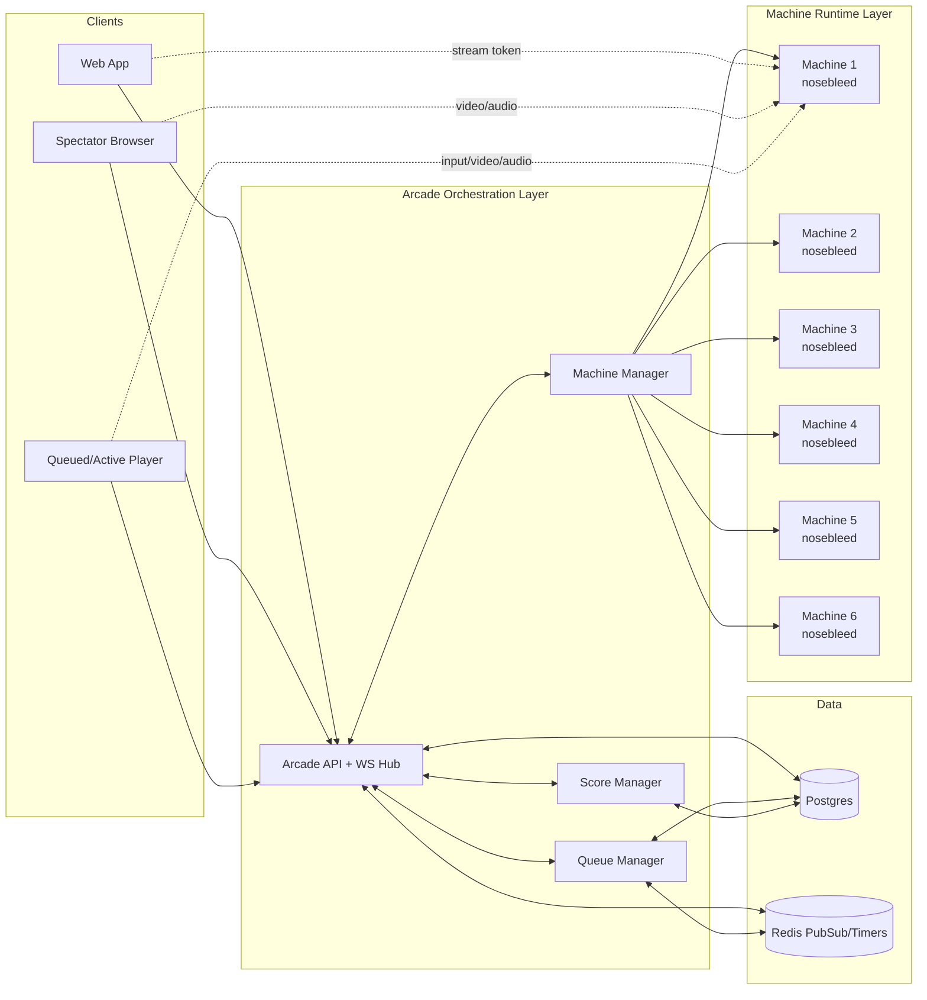
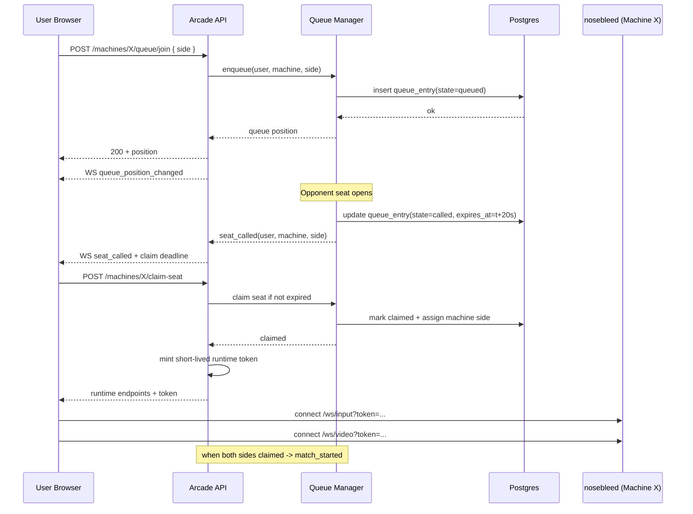
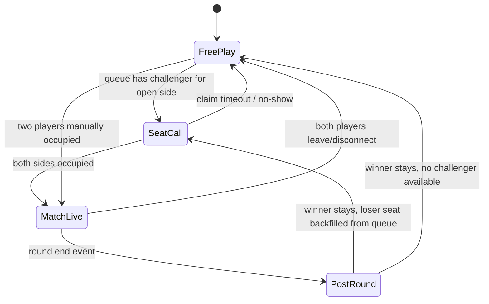

# Virtual Arcade Schematic

This schematic complements `docs/virtual-arcade-blueprint.md` with executable-style diagrams.

## 1) System Architecture

## 2) Join Queue To Match Start Sequence

## 3) Single Machine State Diagram

## 4) Runtime Port Mapping (Recommended)

- Machine side `left` maps to input port `0`.
- Machine side `right` maps to input port `1`.
- Spectators receive media only; no input ports in token.
- Active player tokens include exactly one allowed port.

## 5) Tick/Timer Defaults

- `claim_timeout_ms`: `20000`
- `queue_presence_ttl_ms`: `15000`
- `reconnect_grace_ms`: `15000`
- `no_show_cooldown_ms`: `60000`
- `leaderboard_flush_interval_ms`: `1000`

Treat these as config values, not hardcoded constants.
